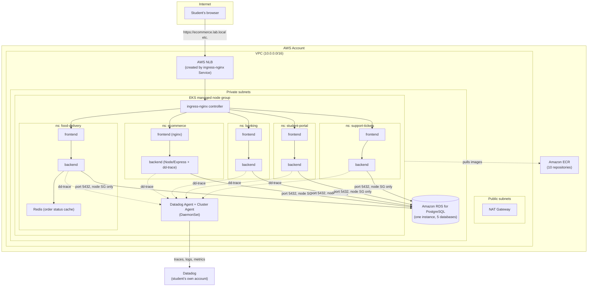

# Architecture

## Overview

The SRE lab runs five independent full-stack applications on a single shared
Amazon EKS cluster, backed by a single shared Amazon RDS for PostgreSQL
instance. Each app is a self-contained namespace with its own frontend,
backend, database, and (for food-delivery) an in-cluster Redis cache. A
single `ingress-nginx` controller, exposed via an AWS Network Load Balancer
(NLB), routes traffic to all five apps by hostname. Datadog's Agent and
Cluster Agent run cluster-wide and collect infrastructure metrics, container
logs, and APM traces from every app.

## Compute: Amazon EKS

- One managed node group, `t3.medium` instances, 2-5 nodes (see
  `terraform/eks.tf`), spread across two private subnets in two AZs.
- Kubernetes 1.33, API access managed via EKS access entries (no aws-auth
  ConfigMap).
- Each app gets its own namespace with a `ResourceQuota` and `LimitRange`
  (see `namespaces/`) so students can observe real resource-pressure
  failure modes (pods stuck `Pending`, OOMKilled at the container limit,
  etc.) rather than infinite headroom.

## Networking

- A single VPC with 2 public subnets (NAT gateway, and the NLB's
  interfaces) and 2 private subnets (EKS nodes and RDS).
- `ingress-nginx` is installed once via Helm, exposed as a `Service` of
  type `LoadBalancer`. On EKS this provisions an AWS NLB automatically --
  no separate load balancer controller needed. Each app gets one
  `Ingress` resource routing by hostname (`<app>.lab.local`) to that app's
  frontend Service.
- **Enterprise alternative**: production EKS clusters more commonly run
  the AWS Load Balancer Controller and provision an ALB per Ingress (or a
  shared ALB via `IngressGroup`), which adds native WAF integration,
  target-group health checks, and path-based routing without an extra
  nginx hop. We used the simpler NLB + ingress-nginx path here because it
  needs no additional IAM roles or controller installation beyond a single
  `helm install`, which matters when every student is standing this up
  independently in a training session.

## Database: Amazon RDS for PostgreSQL

- **One shared RDS instance** (`db.t3.micro`, PostgreSQL 17) backs all five
  apps. Each app gets its own database (`ecommerce_db`, `banking_db`,
  `food_delivery_db`, `student_portal_db`, `support_tickets_db`) and its
  own least-privilege role, created by `scripts/setup.sh` after
  `terraform apply` using the Terraform-generated master credentials.
- The instance sits in private subnets with `publicly_accessible = false`.
  Its security group allows inbound TCP 5432 **only** from the EKS
  cluster's security group -- nothing else, including the internet or the
  student's own laptop, can reach it directly. This is also why database
  provisioning happens via a short-lived pod running inside the cluster
  (`kubectl run ... postgres:17-alpine -- psql ...`) rather than from the
  student's machine.
- **Production tradeoff**: a real production system would very likely give
  each service (or at least each environment) its own RDS instance, so
  that one app's noisy queries, connection storms, or maintenance windows
  can't affect another app's availability, and so that blast radius from a
  compromised app credential is contained to that app's data. We use one
  shared instance here purely to keep AWS costs predictable for a
  classroom of students running this simultaneously -- five
  `db.t3.micro` instances plus five sets of storage would multiply the
  lab's cost for no pedagogical benefit. Note also that by default,
  PostgreSQL grants `CONNECT` on every database to `PUBLIC`, so an app's
  database role can technically open a connection to another app's
  database (though it has no table-level grants there). A hardened
  multi-tenant setup would explicitly `REVOKE CONNECT ... FROM PUBLIC` per
  database.
- **Food-delivery's Redis** is the one exception: it runs in-cluster as a
  plain Kubernetes `Deployment`, because it only caches order-status
  values with a 5 second TTL. There's no data there worth protecting or
  persisting -- if the pod restarts, the cache simply repopulates from
  Postgres on the next read.

## Application layer

Every backend is Node.js + Express, and every frontend is React + Vite +
Tailwind, for consistency across the five apps (see
`apps/<app>/backend` and `apps/<app>/frontend`). Each backend exposes:

- `GET /healthz` -- liveness only, always returns 200 if the process is up.
- `GET /readyz` -- readiness, which runs a real `SELECT 1` against Postgres.
  This is deliberate: the most realistic failure mode with an external,
  network-attached database is "the app is running fine but can't reach
  the database," and a liveness-only check would never catch that.
- `POST /api/chaos/*` -- the built-in chaos hooks (latency, error rate, a
  simulated DB-connection drop, a CPU-blocking spike, and a memory-retaining
  spike), documented in `scripts/chaos/` and used throughout
  `docs/runbooks/` and `docs/incident-scenarios/`.

Unified service tagging (`env`, `service`, `version`) is applied as both
pod labels (`tags.datadoghq.com/*`) and container env vars (`DD_ENV`,
`DD_SERVICE`, `DD_VERSION`) on every Deployment, so a trace, a log line, and
a container metric for the same pod all correlate in Datadog automatically.

## Observability: Datadog

Each student runs their own free-trial Datadog account -- nothing in this
repo contains a real API key. The Datadog Agent and Cluster Agent are
installed once via Helm (`datadog/helm-values.yaml`) with APM and log
collection enabled. Every backend requires `dd-trace` as the very first
line executed (`src/tracer.js`, loaded via `-r`), so a single HTTP request
is traceable frontend -> backend -> Postgres in APM. See
`docs/student-guide.md` for the exact account setup and install steps, and
`datadog/dashboards/` + `datadog/monitors/` for importable dashboard and
monitor definitions.

## What's deliberately simplified for a training lab

| Simplification | What production would do instead |
|---|---|
| One shared RDS instance for all 5 apps | One instance per app/environment |
| Plaintext password comparison for banking/student-portal demo login | bcrypt/argon2 hashing, real session management |
| `ingress-nginx` + NLB | AWS Load Balancer Controller + ALB, likely with WAF |
| Chaos endpoints reachable over the public Ingress | Chaos hooks gated behind a separate internal-only port/network policy |
| Terraform state stored locally | Remote state (S3 + DynamoDB lock table) |
| No TLS on the Ingress | ACM certificate + HTTPS redirect |
